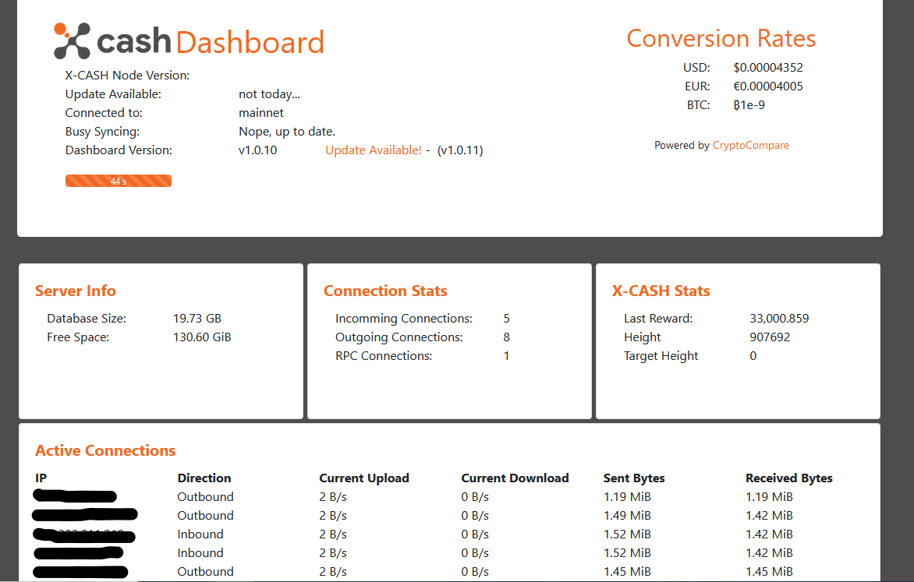

# xcash-dashboard

The X-Cash Dashboard was designed to be a nicely formatted viewport into your local X-CASH node.



# Requirements

A local xcash daemon running.
`NPM`
`Node`

You can connect to a remote node also.

# Notice

If you run xcashd with `--restricted-rpc`, it will not show `Active Connections` on the dasboard, as the RPC will not respond to that command.

# Getting Started

The dashboard is a node application that runs on port `3000` and connects to a full node running at `localhost:18281`. These defaults can be changed by creating a `.env` file (copied from`sample.env`).

Download:
```git clone https://github.com/element0355/xcash-dashboard.git```

Move to the xcash-dashboard folder:
```
cd xcash-dashboard
```

Make changes to the `sample.env` file (description of settings below):
```
nano sample.env
```

Move `sample.env` to `.env`:
```
mv sample.env .env
```

**.env**

```
XCASH_HOST=10.1.1.1
XCASH_PORT=18281
```

All Settings:

```
XCASH_HOST=<IP of remote node> | defaults to localhost
XCASH_PORT=<port of remote node> | defaults to 18281
TICKER=<enable X-Cash ticker> | defaults to false
PORT=<port to run the app> | defaults to 3000, needs elevated access to run at 80
```

That said, the host machine will need to have `node` and `npm` installed.

```
sudo apt install nodejs npm
```

To Start the dashboard, run `npm start` inside the `xcash-dashboard` folder.

Access the dashboard at `http://localhost:3000`

# Contributing

Please feel free to either submit issues for improvements, or fork the repo and make pull requests.

Open up all pull requests against the `xcash_dev` branch.

### Donate

XCA1T2PWnamcbC4adG1L17XiCvqCDB3EwDzr1MEYxy4rQfzxxuiPdeTRSgtXbghVAVVgRK6V26ZwK2JqXTfkvDH34dJgDKb2F7


